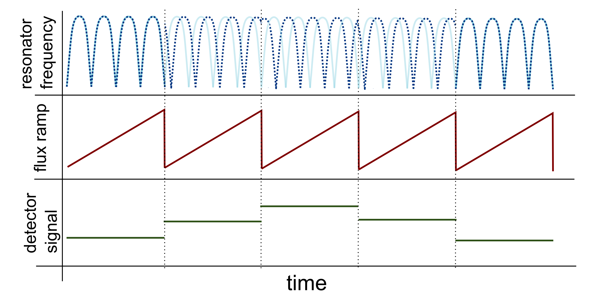
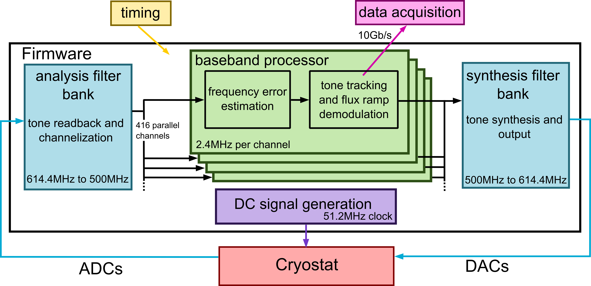
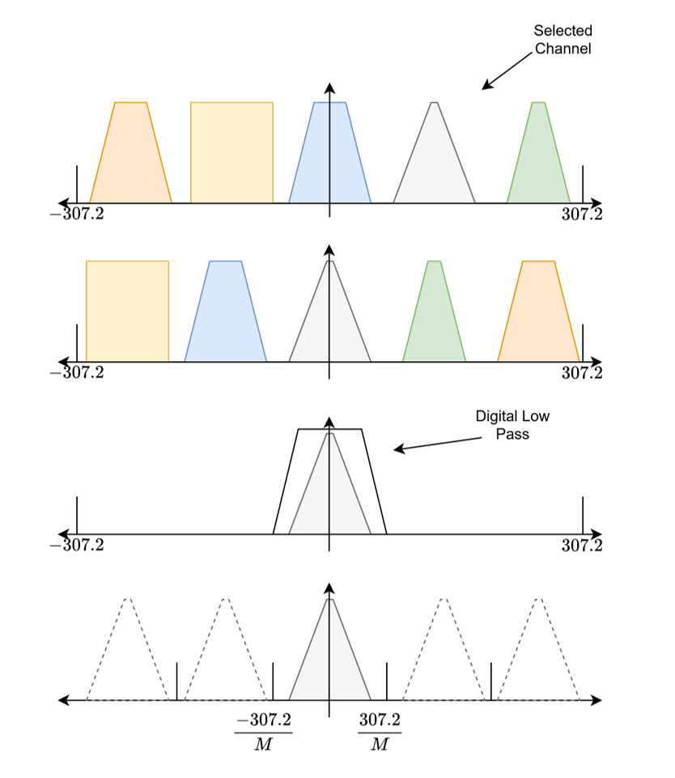
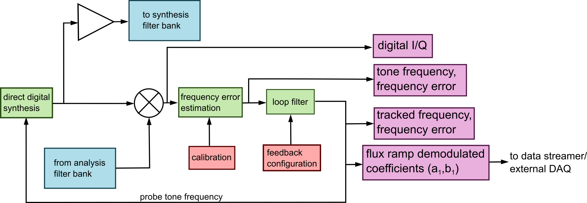
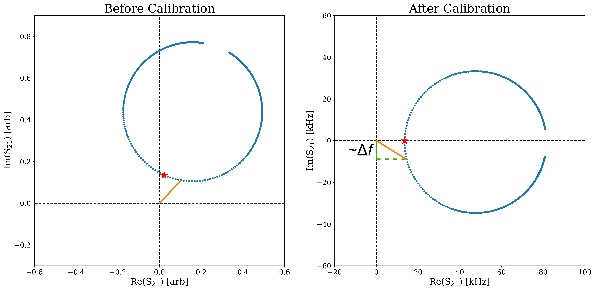

Concepts
========

This page explains the signal processing and algorithms at a level
useful for operators. See `Yu et al. 2022
<https://arxiv.org/abs/2208.10523>`_ for derivations and performance
measurements.

Resonator Readout
-----------------

Superconducting microwave resonators appear as dips in forward
transmission (S21) on a shared RF feedline. For umux, an RF SQUID
couples each TES to a unique resonator -- detector current shifts the
resonance frequency. A **flux ramp** (sawtooth) drives all SQUIDs
through multiple flux quanta, linearizing the periodic SQUID response.
The detector signal appears as a phase shift in this modulation.

   Flux ramp phase modulation. Top: resonance frequency vs. time.
   Middle: flux ramp sawtooth. Bottom: slow detector signal appears as
   phase shift of the periodic response.

Firmware Signal Chain
---------------------

   Firmware block diagram. Blue: polyphase filter banks. Green:
   baseband processor. Yellow: timing. Pink: streaming. Purple: DC
   generation.

**Polyphase filter bank** -- splits 614.4 MHz baseband into 512
time-multiplexed 2.4 MHz channels (2x oversampled, 100 dB rejection,
~6 us delay). Only 416 channels per band are used (center 500 MHz).

   Conceptual single-channel downconversion: multiply by channel
   frequency, lowpass filter, decimate by 256.

**Baseband processor** -- per-channel processing at 2.4 MHz:

   Per-channel baseband processor. Red: external inputs. Green: FPGA
   computation. Blue: filter bank interface. Pink: data outputs.

Eta Calibration
---------------

The **eta parameter** converts IQ response into a frequency error
estimate. It rotates and scales the resonator circle so small
frequency shifts map to a single quadrature:

.. math::

   \eta = \frac{2\Delta f}{(I_+ - I_-) + j(Q_+ - Q_-)}

.. math::

   \hat{\Delta f} = \mathrm{Im}\left[S_{21} \times \eta\right]

   Left: uncalibrated resonator in complex plane. Right: after eta
   rotation, frequency shifts project onto one axis.

Eta is measured once per resonator (``S.eta_scan()``) and is stable
typically stable across cooldowns. It is stored in firmware BRAM as etaMag + etaPhase.

Tone Tracking
-------------

SMuRF's tracking loop minimizes the frequency error by updating probe
tone frequencies in real time. The algorithm parameterizes the
flux-ramp-modulated resonance as a truncated Fourier series (DC + 3
harmonics = 7 coefficients per channel):

.. math::

   \hat{f}[n] = \sum_{i=1}^{3}\left(a_i \sin\omega_i n + b_i \cos\omega_i n\right) + C

Updated each sample via stochastic gradient descent:

.. math::

   \vec{\alpha}[n+1] = \vec{\alpha}[n] + \mu\,\hat{\Delta f}[n]\,\vec{h}[n]^T

where mu is the tracking gain (``lmsGain`` in firmware). The
demodulated detector signal is the phase of the first harmonic:

.. math::

   \theta = \arctan(b_1 / a_1)

averaged over each flux ramp frame and streamed at the frame rate.

**Why tone tracking matters**: by keeping tones at S21_min, power on
the cryogenic amplifier is reduced 5--10 dB per tone. This suppresses
intermodulation products and enables 1000+ channel multiplexing
without linearity degradation.

Flux Ramp
---------

- **Reset rate**: typically 2--10 kHz (= detector sample rate)
- **Phi0 rate**: reset_rate x phi0_per_ramp (typ. 4--6); should be
  >10 kHz to exceed resonator TLS 1/f
- **Blanking**: configurable dead time around sawtooth resets excluded
  from tracking to avoid transients
- **Carrier frequency** (f1): phi0_rate, the fundamental tracked by
  the loop filter

Data Output Levels
------------------

The firmware supports multiple tap points:

1. **Raw IQ** (2.4 MHz/ch) -- ``take_debug_data()``
2. **Frequency + delta-f** -- after eta, before tracking
3. **Demodulated phase** (frame rate) -- ``take_stream_data()``

The software SMuRF Processor further applies phase unwrapping, a 4th
order Butterworth lowpass (default 63 Hz at 4 kHz), downsampling, and
file writing.
