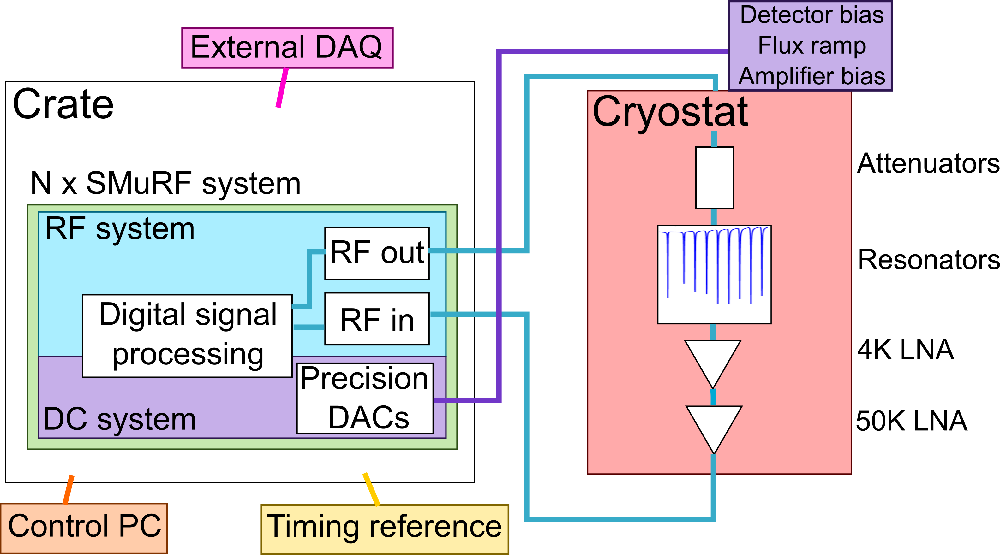
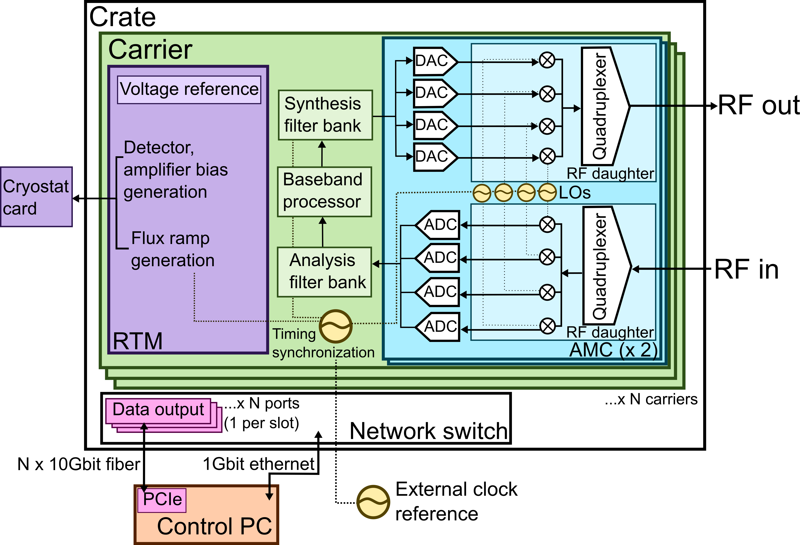

Introduction
============

pysmurf is the Python control software for the SLAC Microresonator RF
(SMuRF) cryogenic detector readout system. It reads out
frequency-multiplexed superconducting microresonator arrays (umux TES
bolometers, MKIDs) via closed-loop tone tracking.

For the full instrument description, see `Yu et al. 2022
<https://arxiv.org/abs/2208.10523>`_.

   Typical SMuRF integration. RF probe tones interrogate cryogenic
   resonators; DC lines supply TES bias, flux ramp, and amplifier bias.

Hardware Overview
-----------------

   Block diagram of a full SMuRF system. Green: FPGA carrier. Blue:
   AMCs and RF daughter cards. Purple: RTM and cryostat card.

A single SMuRF system occupies one slot in an ATCA crate and consists
of:

**FPGA carrier** (Xilinx KU15P) -- performs all real-time DSP: tone
synthesis/analysis via polyphase filter banks, per-channel tone
tracking, flux ramp demodulation, and data streaming.

**Advanced Mezzanine Cards (AMCs)** -- up to 2 per carrier, each
providing 2 GHz of RF bandwidth. Each AMC has 4 ADC/DAC pairs
(defining 4 bands), clock generation, and an LO that up/downmixes
between the ~614 MHz digital baseband and the 4--8 GHz RF frequencies.
Interchangeable RF daughter cards select low-band (4--6 GHz) or
high-band (6--8 GHz) operation.

**Rear Transition Module (RTM)** -- generates low-frequency signals:

- **TES bias**: bipolar DAC pairs providing DC voltage bias to
  detector bias groups
- **Flux ramp**: sawtooth waveform that drives all SQUIDs on a line
  through multiple flux quanta, linearizing the SQUID response
- **Amplifier bias**: gate/drain voltages for cryogenic 4K and 50K
  LNAs

**Cryostat card** -- mounts at the cryostat vacuum feedthrough;
conditions and filters the RTM signals before they enter the cryostat.

The system reads out up to **3328 channels** across 4 GHz, consuming
~210 W per slot.

Bands, Sub-bands, and Channels
-------------------------------

.. list-table::
   :header-rows: 1

   * - Construct
     - Width
     - Count
     - Hardware mapping
   * - **Band**
     - 500 MHz
     - 0--7
     - One ADC/DAC pair on an AMC; 4 bands per AMC, 2 AMCs per carrier
   * - **Sub-band**
     - 2.4 MHz
     - 512 per band (416 processed)
     - One bin of the 2x-oversampled polyphase filter bank; one
       channel processor slot
   * - **Channel**
     - 2.4 MHz
     - 0--511 per band (416 active)
     - 1:1 with sub-band; one tracked resonator

A **band** corresponds to the 500 MHz analog bandwidth of one
ADC/DAC pair. Each AMC has 4 bands; the LO on each AMC up/downmixes
between baseband and the target RF frequency, and the bands are
stitched together via a quadruplexer to cover up to 4 GHz total
(4--8 GHz with two AMCs).

The polyphase filter bank channelizes each band into 512
**sub-bands**, each 2.4 MHz wide (2x-oversampled 64-point FFT,
yielding overlapping bins). Each sub-band holds exactly one
**channel** -- a single tracked resonator. The outer sub-bands are
dropped to stay within the analog filter passband, leaving 416 active
channels per band.

In pysmurf, you address a resonator by its (band, channel) pair.
Most single-bay setups use bands 0--3.
